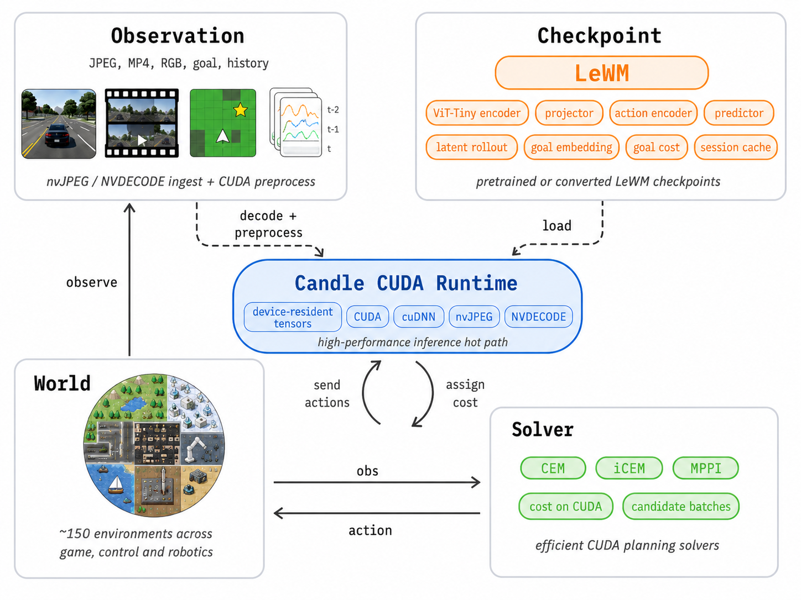
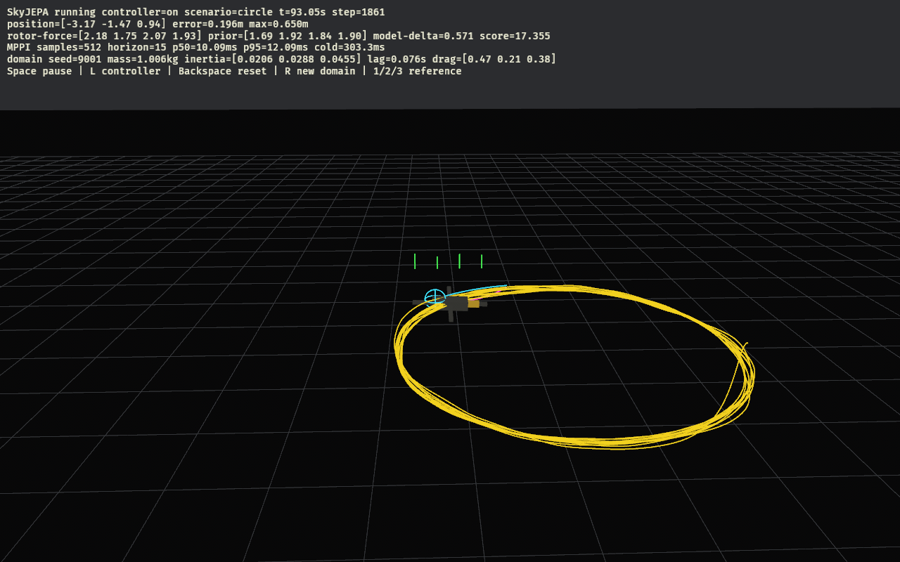
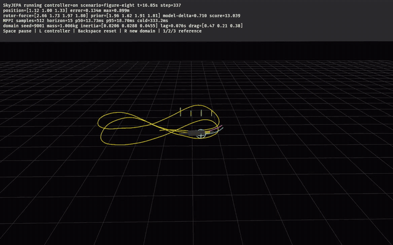
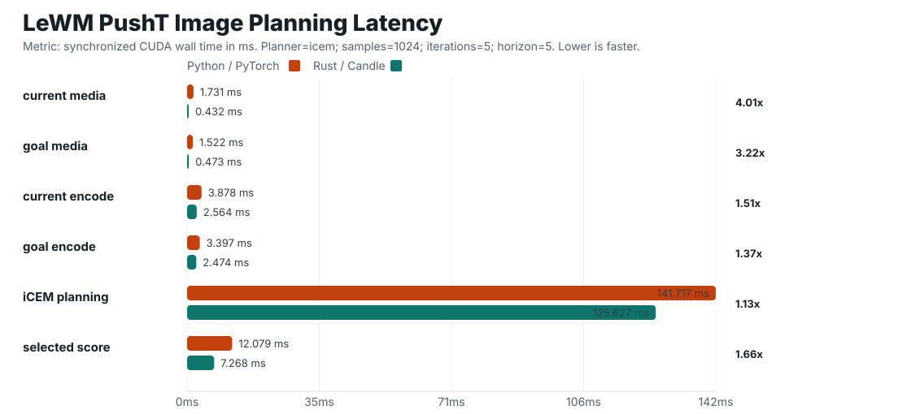

# le-wm-nv

NVIDIA/CUDA-first LeWM and SkyJEPA training, inference, and control runtime.



This repo supports two model families. LeWM remains the upstream-compatible
image/vector baseline from `stable-worldmodel`. SkyJEPA is a separate,
repo-native state/action world model for long-horizon quadrotor dynamics and
metric MPPI control. SkyJEPA does not replace or remove LeWM.
The runtime target is Linux with NVIDIA hardware, CUDA, cuDNN, nvJPEG,
NVDECODE, and Candle CUDA tensors. The hot paths are:

```text
image/video observation -> CUDA preprocess -> LeWM encode -> candidate rollout -> cost -> action
vector/state observation -> normalize -> LeWM encode -> candidate rollout -> cost -> action
UAV state18/action4 -> SkyJEPA TCN/GRU -> physics prober -> metric MPPI -> rotor forces
```

## SkyJEPA UAV control

These are real frames from the dedicated Bevy simulator running the trained
pilot checkpoint on a held-out randomized rotor plant. Yellow is the executed
trajectory, cyan is the current reference horizon, magenta is SkyJEPA's metric
prediction, and the green bars are the four commanded rotor forces. The HUD
shows the geometric prior and the learned correction separately; these are not
scripted animation captures.

| Randomized circle | Randomized figure-eight |
| --- | --- |
|  | [](docs/skyjepa-trained-figure-eight.mp4) |

**Video:** [watch the 20-second trained SkyJEPA figure-eight flight](docs/skyjepa-trained-figure-eight.mp4)
at normal simulation speed. Yellow is executed, cyan is reference, magenta is
predicted, and green shows rotor force.

The model in those captures was trained locally on an RTX 4090 from 2,000
ten-second trajectories across 100 randomized domains (402,000 state/action
rows). At the paper's controller setting of 512 candidates and horizon 15, the
automated gate passed all 63 nominal and held-out hover, circle, and
figure-eight runs:

| Closed-loop result | SkyJEPA + prior | Matched prior only |
| --- | ---: | ---: |
| Successful runs | **63 / 63** | 62 / 63 |
| Mean trajectory RMSE | **0.2210 m** | 0.2245 m |
| Worst trajectory RMSE | **0.407 m** | 0.888 m |
| Worst position error | **0.984 m** | 1.394 m |
| Aggregate p95 planning latency | **8.64 ms** | 0.0013 ms |

The prior-only column is important: SkyJEPA is not being credited for the
geometric stabilization shared by both controllers. It measures whether the
learned dynamics correction improves the same nominal flight sequence. The
learned controller eliminated the one prior-only failure and substantially
reduced the worst-domain error. The screenshots use accelerated visualization,
so their render-contended HUD latency is not the headless benchmark above.

### How this was built without released implementation code

When this implementation was written on 2026-09-03, the
[authors' SkyJEPA repository](https://github.com/arplaboratory/SkyJEPA) stated
that code, data, and pretrained models were forthcoming. There was no Python
model or controller source to translate. This is therefore a clean-room
Rust/Candle implementation of the contracts published in the
[SkyJEPA paper](https://arxiv.org/html/2606.23444), not a claim of source-level
upstream parity.

We separated the reconstruction into things the paper specifies and things it
does not:

- From the paper: state18 and individual rotor-force action4, history 10,
  rollout 20, state/action causal TCN channel sizes, latent/GRU width 24,
  two-stage frozen-latent training, SIGReg weight and knots, the
  physics-inspired prober outputs, SO(3) metric integration, MPPI horizon and
  512-sample budget, action-noise scales, temperature, and control costs.
- Explicit local choices: the internal residual TCN block layout, the small
  prober MLP layout, 64 SIGReg projection directions, the random-Fourier
  periodic-reference generator, the geometric data-collection tracker, and an
  arm-length randomization range omitted from the paper's parameter table.
  These choices are versioned in [the detailed SkyJEPA notes](docs/skyjepa.md).

The implementation/evidence loop was:

1. Define a canonical HDF5 contract for state, commanded rotor force, realized
   motor force, reference state, episode, time step, and randomized domain.
2. Build a 200 Hz rigid-body/SO(3) rotor plant and collect control-rich data at
   20 Hz. The first pilot was rejected after a new audit showed that its
   differential rotor excitation was too small; the generator was strengthened
   before the accepted data was trained.
3. Reconstruct the paper's latent TCN/GRU objective and physics prober natively
   in Candle. Training is staged, deterministic, resumable with optimizer
   state, guarded by the audited dataset SHA-256, and promotes best-validation
   safetensors rather than merely the last step.
4. Keep the control hot path on CUDA: encode state history once, flatten all
   sampled rolling action windows into one action-TCN batch, recursively unroll
   the GRU, and advance each metric candidate with a fused CUDA integrator.
5. Add a trim-aware geometric action prior after early closed-loop experiments
   showed that sampling raw rotor forces was not a reliable flight initializer.
   SkyJEPA's role is now precise: predict and optimize the correction around a
   stable nominal flight sequence.
6. Validate at three levels: per-horizon offline metrics against
   constant-velocity and kinematic baselines, deterministic closed-loop gates
   against unseen domains, and an interactive simulator using the same reusable
   checkpoint-backed controller session as the headless tools.

This process also found a real boundary rather than only successes. On an
independently generated 500-trajectory OOD dataset, SkyJEPA slightly beat the
constant-velocity position baseline at 0.25 seconds (`0.0519 m` versus
`0.0535 m`), but lost at 1 second (`0.818 m` versus `0.769 m`) and degraded
further by 3 seconds. The current checkpoint demonstrates a working, fast,
learned closed-loop stack; it does not yet establish superior long-horizon
open-loop prediction. Reproduction commands, audit thresholds, checkpoint
contents, simulator controls, and the full pilot evidence are in
[docs/skyjepa.md](docs/skyjepa.md).

## Mandate

Performance is the primary acceptance criterion. The repo is not a portability
layer, and non-Linux/non-NVIDIA targets are intentionally out of scope.

Runtime work should keep media buffers, preprocessed tensors, embeddings,
candidate action batches, rollouts, costs, and selected actions in the
Rust/Candle CUDA path. Python is included for bootstrap, checkpoint conversion,
data export, and parity checks against the official implementation. Python is
not the deployment runtime.

When Candle lacks a needed NVIDIA primitive, the preferred direction is a
focused Candle CUDA op, a direct NVIDIA library binding, or a CUDA-compatible
crate that preserves device residency.

The strategic use case is fast learned dynamics for control. Given recent
observation/action logs from an unknown platform, the repo should be able to
train a compact action-conditioned LeWM world model in minutes on one GPU, then
use that model as the predictive core for MPC-style rollout, scoring, and
control selection. That makes pre-deployment or in-transit model refresh
plausible: collect logs, train, run fixed validation probes, and load the model
before the vehicle starts the real task. This is a world-model claim, not a
claim about vision, navigation, or full autonomy.

Validation claims must stay inside the logged data distribution. Trainers
produce model-family-specific checkpoints; task-specific evaluators must back
control or dynamics-quality claims. SkyJEPA includes per-horizon open-loop
metrics and a closed-loop simulator, while LeWM keeps its existing parity and
drone evaluation paths.

## Capabilities

- LeWM model runtime: ViT-Tiny image encoder, vector MLP observation encoder,
  projector, action encoder, predictor, latent rollout, goal embedding, goal
  cost, and session caching.
- LeWM planning: CEM, MPPI, and iCEM over Candle CUDA tensors.
- NVIDIA image/video ingest: nvJPEG decode into CUDA tensors, packed RGB/BGR
  CUDA preprocessing, NV12 CUDA preprocessing, and NVDECODE capability/parser
  plumbing.
- LeWM training surface: upstream-style predicted embedding loss plus SIGReg,
  batch-loss API, AdamW training CLIs, PushT HDF5 dataset streaming, drone
  vector-observation dataset training, and safetensors save/reload.
- Native SkyJEPA surface: full UAV state18/rotor-force action4 schema,
  causal-TCN encoders, recursive GRU latent dynamics, SIGReg, frozen
  physics-inspired prober, differentiable SO(3) integration, batched MPPI,
  audited domain-randomized data generation, resumable best-checkpoint staged
  training, fixed-normalization long-horizon evaluation with baselines,
  trim-aware low-latency control, closed-loop scenario gating, and a dedicated
  Bevy rotor-force simulator.
- Python bootstrap tooling: official `stable-worldmodel[train]` package via
  `uv`, checkpoint conversion, PushT batch export, Python parity fixture export,
  and Python-vs-Rust image-planning benchmark scripts.
- Hugging Face checkpoint download is available with `--features hub`.

The audited upstream `stable-worldmodel` commit is tracked in
[docs/upstream-stable-worldmodel.md](docs/upstream-stable-worldmodel.md).
The SkyJEPA implementation and paper/code assumptions are tracked in
[docs/skyjepa.md](docs/skyjepa.md).

## LeWM Runtime Extensions

The image LeWM runtime is a Rust/Candle port of the audited upstream
`stable-worldmodel` architecture: ViT image encoder, projector, action encoder,
AdaLN-conditioned predictor, prediction projection, autoregressive latent
rollout, and goal-embedding cost. Checkpoint tensor layout and model math are
kept compatible with upstream image LeWM parity fixtures.

Repo-native extensions live around that core instead of replacing it:

- Modular observation encoders: image observations use the upstream-compatible
  ViT path; vector/state observations use a `VectorMlp` encoder with the same
  LeWM action encoder, predictor, and autoregressive rollout pattern.
- Drone vector LeWM: `lewm-drone-import` imports vector/state logs and
  `lewm-train-drone` trains the modular vector-observation model with the same
  LeWM objective used by the image trainers. No supervised decoder head is part
  of the model. The drone trainer follows upstream LeWM history semantics:
  each training sample contains `history_steps + num_preds` observations, the
  predictor has `history_steps` positional frames, and longer horizons are
  produced only by autoregressive rollout during planning/evaluation.

Architecture-preserving performance work is allowed and should be documented
here when landed. It may cache non-learned tensors, reduce tensor assembly,
reuse fixed-shape workspaces, add focused CUDA kernels, or use CUDA graph
capture. It must not change learned layer shapes, checkpoint tensor layout,
positional-embedding semantics, history semantics, predictor depth/heads, action
encoder math, rollout horizon, planner sample budget, controller cadence, or
silently introduce CPU planning/scoring paths. Runtime optimization benchmarks
must hold model and planner settings fixed.

## Prerequisites

- Linux host with NVIDIA GPU
- CUDA toolkit and driver libraries
- cuDNN available to Candle
- `libnvjpeg.so`
- `libnvcuvid.so`
- Rust toolchain from `rust-toolchain.toml`
- `uv`

The build script requires `libnvjpeg.so` and `libnvcuvid.so`. Set `CUDA_HOME`,
`CUDA_PATH`, or `NVIDIA_VIDEO_CODEC_SDK_PATH` if they are not under standard
system library paths.

## Build

```bash
cargo check --locked --all-targets
cargo test --locked
```

With Hugging Face Hub checkpoint download:

```bash
cargo check --locked --features hub --all-targets
```

## Python Bootstrap

The repo includes `.python-version`, `pyproject.toml`, and `uv.lock`.
`pyproject.toml` defines the supported Python range and dependencies, including
`stable-worldmodel[train]`.

```bash
uv sync --locked --no-dev
```

Convert a PyTorch state dict to safetensors:

```bash
uv run --locked --no-dev \
  python tools/convert_state_dict_safetensors.py \
  --input /path/to/weights.pt \
  --output target/model.safetensors
```

## LeWM Parity

Export a deterministic CUDA fixture from the official Python implementation:

```bash
uv run --locked --no-dev \
  python tools/export_lewm_fixture.py \
  --model quentinll/lewm-pusht \
  --device cuda \
  --output target/lewm-pusht-python-cuda.npz
```

Compare Rust/Candle CUDA against that fixture:

```bash
cargo run --release --locked --features hub --bin lewm-compare-fixture -- \
  --device cuda \
  --fixture target/lewm-pusht-python-cuda.npz \
  --hf-repo quentinll/lewm-pusht
```

Run checkpoint-backed planning from fixture tensors:

```bash
cargo run --release --locked --features hub --bin lewm-plan-fixture -- \
  --device cuda \
  --fixture target/lewm-pusht-python-cuda.npz \
  --hf-repo quentinll/lewm-pusht \
  --planner icem \
  --samples 128 \
  --iterations 3 \
  --seed 7
```

Validation snapshot on 2026-06-03, RTX 4090, `quentinll/lewm-pusht`,
PyTorch `2.12.0+cu130`, CUDA `13.0`:

| Output | Max Abs |
| --- | ---: |
| `emb` | `5.731881e-4` |
| `act_emb` | `4.768372e-7` |
| `pred` | `7.328391e-4` |
| `rollout` | `6.533712e-4` |
| `cost` | `5.619049e-3` |

Cost argmin was stable for the fixture batch.

## Performance Snapshot



Snapshot on 2026-06-03, RTX 4090, `quentinll/lewm-pusht`, CUDA 13.0,
`planner=icem`, `samples=1024`, `iterations=5`, `horizon=5`, `history_size=3`.
Metric is synchronized CUDA p50 wall time after 2 warmup runs and 5 measured
runs. Python is vanilla `stable-worldmodel` LeWM through PyTorch; Rust is
`lewm-plan-images` with nvJPEG decode, Candle CUDA encode/rollout/scoring, and
Rust-native planning. In this image-input PushT benchmark, Rust/Candle is faster
across the hot path: 3-4x for media decode/preprocess, 1.37-1.51x for image
encoding, 1.13x for iCEM planning, and 1.66x for selected-score evaluation.

## Image Planning

Plan from JPEG current/goal images through nvJPEG, CUDA preprocessing, LeWM,
and Rust-native planning:

```bash
cargo run --release --locked --features hub --bin lewm-plan-images -- \
  --device cuda \
  --hf-repo quentinll/lewm-pusht \
  --current current.jpg \
  --goal goal.jpg \
  --planner icem \
  --samples 1024 \
  --iterations 5 \
  --output target/reports/lewm-pusht-plan.html
```

## Training

The drone vector trainer follows the upstream LeWM shifted-context objective:

```text
ctx = embedding[:, :history_size]
target = stopgrad(embedding[:, num_preds:])
pred = predictor(ctx, action[:, :history_size])

loss = mse(pred, target)
     + 0.09 * SIGReg(online_embeddings)
```

Shared SIGReg uses the upstream default `17` knots, `1024` random projections,
and the upstream Gaussian-windowed integration weights. The trainer CLIs do not
expose alternate auxiliary loss weights.

Export a PushT image/action batch and run a Rust/Candle CUDA training step:

```bash
uv run --locked --no-dev \
  python tools/export_pusht_lewm_training_batch.py \
  --output target/pusht-lewm-training-batch.npz \
  --batch-size 2 \
  --history-size 3 \
  --action-block 5 \
  --seed 7

cargo run --release --locked --bin lewm-train-batch -- \
  --device cuda \
  --batch-npz target/pusht-lewm-training-batch.npz \
  --steps 10 \
  --lr 1e-5 \
  --output target/pusht-lewm-trained.safetensors
```

Train LeWM from the PushT HDF5 dataset without Python in the data/training
path. Long-running training outputs should live outside `target/`, because
`target/` is disposable build output:

```bash
tools/launch_pusht_from_scratch.sh
```

By default the launcher writes checkpoints, optimizer state, metrics, logs, and
`train.pid` to
`~/.stable_worldmodel/le-wm-nv-runs/pusht-from-scratch-b96`. If
`training-state.json` already exists there, it resumes from that run directory.
Override settings with environment variables, for example
`RUN_DIR=/mnt/runs/pusht-b96 BATCH_SIZE=64 tools/launch_pusht_from_scratch.sh`.

Equivalent direct command:

```bash
cargo run --release --locked --bin lewm-train-pusht -- \
  --device cuda \
  --dataset-h5 ~/.stable_worldmodel/pusht_expert_train.h5 \
  --epochs 100 \
  --batch-size 96 \
  --history-size 3 \
  --action-block 5 \
  --output-dir ~/.stable_worldmodel/le-wm-nv-runs/pusht-from-scratch-b96
```

`lewm-train-pusht` reads `pusht_expert_train.h5` natively through Rust HDF5
with in-process Blosc filter support. It reproduces the Python exporter dataset
semantics: valid row selection from `episode_idx`, `step_idx`, and `ep_len`;
image history rows at `row + idx * action_block`; flattened action blocks; and
dataset-wide action mean/std normalization. Because PushT H5 pixels are already
decoded RGB arrays, the optimized path is HDF5 host reads, raw RGB
host-to-CUDA transfer, CUDA resize/normalize/history assembly, and LeWM
training on Candle CUDA tensors. It does not use nvJPEG or NVDECODE.

The trainer writes `metrics.jsonl`, `dataset-summary.json`, `model-config.json`,
`training-state.json`, `latest.safetensors`, periodic
`checkpoint-step-*.safetensors` files, `optimizer.safetensors`, periodic
`optimizer-step-*.safetensors` files, `final.safetensors`, and
`final-optimizer.safetensors`. Use `--init-safetensors` for a weights-only warm
start. Use `--resume-dir` for exact continuation from `latest.safetensors`,
`optimizer.safetensors`, and `training-state.json`; the trainer resumes from the
saved `global_step`, which maps deterministically back to the same epoch shuffle
and next batch.

```bash
cargo run --release --locked --bin lewm-train-pusht -- \
  --device cuda \
  --dataset-h5 ~/.stable_worldmodel/pusht_expert_train.h5 \
  --resume-dir ~/.stable_worldmodel/le-wm-nv-runs/pusht-from-scratch-b96 \
  --epochs 100 \
  --batch-size 96 \
  --history-size 3 \
  --action-block 5 \
  --output-dir ~/.stable_worldmodel/le-wm-nv-runs/pusht-from-scratch-b96
```

## Reports

Run the PushT environment demo through Rust planning:

```bash
uv run --locked --no-dev \
  python tools/run_pusht_lewm_rust_demo.py \
  --hf-repo quentinll/lewm-pusht \
  --planner icem \
  --replans 2 \
  --output-dir target/reports/pusht-lewm-demo
```

Run the same demo with a locally trained Rust checkpoint:

```bash
uv run --locked --no-dev \
  python tools/run_pusht_lewm_rust_demo.py \
  --weights ~/.stable_worldmodel/le-wm-nv-runs/pusht-from-scratch-b96/latest.safetensors \
  --config ~/.stable_worldmodel/le-wm-nv-runs/pusht-from-scratch-b96/model-config.json \
  --planner icem \
  --history-size 1 \
  --replans 2 \
  --output-dir ~/.stable_worldmodel/le-wm-nv-reports/pusht-from-scratch-demo
```

Run Python-vs-Rust image-planning benchmark tooling:

```bash
uv run --locked --no-dev \
  python tools/benchmark_lewm_plan_images_python.py \
  --model quentinll/lewm-pusht \
  --current current.jpg \
  --goal goal.jpg \
  --output target/bench/lewm-plan-images-python.json
```
